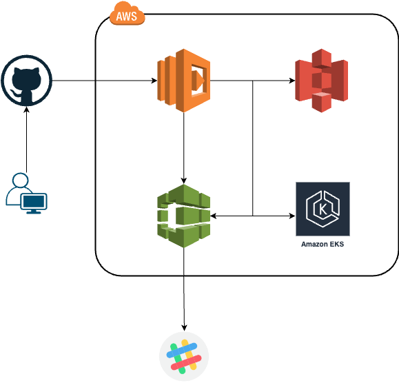

# EKS へ自動でデプロイするサンプルコード

このコードは、 `GitHub Action` で `Release` を作成したら
自動で `EKS(Elastic Kubernetes Service)` にデプロイします。

## 全体図



## ディレクトリ構成

```bash
.
├── .github/workflows/release.yaml
├── app
├── assets
└── deployments
```

### `.github/workflows/release.yaml`

`Code pipeline` を自動で実行するための `GitHub Action` ファイル

### `app`

サンプルアプリケーションのコード。  
必要最小限のコードとデプロイするための最低限のファイルなどを格納している。

### `assets`

`REAME.md` 用の画像ファイルなどを格納している。

### `deployments`

環境を作成するための `AWS CDK` のコードを格納している。


## 流れ

### 1. `deployments` にあるコードを使って、環境を作成する

### 2. `.github/workflows/release.yaml` の `PIPELINE_ENDPOINT` に `1` で作成した `Lambda` のエンドポイントを記述する

### 3. `GitHub` 上で `Relase` 作業を実施する

## 注意点
本来アプリケーションのコードとインフラを作成するコードは別々のリポジトリで管理するのと思われるけど、  
管理の便宜上同じリポジトリで管理しています。
なので、実際使う場合は `app` と `deployments` を別々のリポジトリで管理するようにした方が良いかなと思います。
